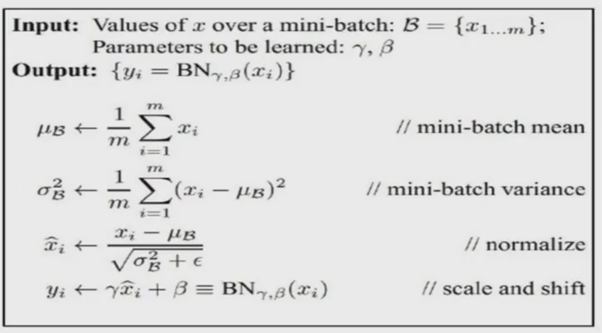

# 参数设置

## 1. 随机梯度下降（SGD）

（1）不用每输入一个样本就去变换参数，而是输入一批样本（叫做一个Batch或Mini-Batch），求出这些样本的梯度平均值后，根据这个平均值改变参数。

（2）在神经网络训练中，Batch的样本数大致设置为50-200不等。

## 2. 激活函数选择

## 3. 训练数据初始化

建议：做均值和方差的归一化。

将输入样本减去它的均值再除以方差。

$$
newX = \frac{X-mean(X)}{std(X)}
$$

## 4. (W, b) 初始化

梯度消失现象：如果 $W^TX+b$ 一开始很大或很小，那么梯度将趋近于0，反向传播后前面与之相关的梯度也趋近于0，导致训练缓慢。

因此 我们要使 $W^TX+b$ 一开始在0附近。

一种简单有效的方法是：
$(W,b)$ 初始化从区间 $(-\frac{1}{\sqrt{d}},\frac{1}{\sqrt{d}})$ 均匀随机取值。其中 $d$ 为 $(W,b)$ 所在层的神经元个数。
可以证明，如果 $X$ 服从正态分布，均值0， 方差1，且各个维度无关，而 $(W,b)$ 是 $(-\frac{1}{\sqrt{d}},\frac{1}{\sqrt{d}})$ 的均匀分布，则  $W^TX+b$ 是均值为0，方差为 $\frac{1}{3}$ 的正态分布。

## 5. Batch Nomalization

思想：既然我们希望每一层获得的值都在0附近，从而避免梯度消失现象，那么我们为什么不直接把每一层的值做基于均值和方差的归一化呢？

每一层FC（Fully Connected Layer）接一个BN（Batch Normalization）层：
$$
\widehat{x}^{(k)} = \frac{x^{(k)}-E[x^{(k)}]}{\sqrt{Var[x^{(k)}]}}
$$

算法流程：

## 6. 目标函数选择

（1）可加**正则项（Regulation Term）**
$$
\begin{aligned}
    L(W) & = F(W) + R(W) \\
    & = \frac{1}{2} \left( \sum_{i=1}^{batch\_size} ||y_i-Y_i||^2 + \beta \sum_k \sum_l W_{k,l}^2 \right)
\end{aligned}
$$

（2）如果是分类问题，$F(W)$ 可以采用Softmax函数和交叉熵的组合

（a）**Softmax函数**

我们希望通过此网络学习由 $Z = \begin{bmatrix} z_1 \\ z_1 \\ \vdots \\ z_N \end{bmatrix}$ 到 $P = \begin{bmatrix} p_1 \\ p_1 \\ \vdots \\ p_N \end{bmatrix}$ 的映射，其中 $\sum_{i-1}^Np_i = 1$

（b）**交叉熵（Cross Entropy）**

定义目标函数为：

$$
E=-\sum_{i=1}^N p_i log(q_i)
$$

如果$F(W)$是Softmax函数和交叉熵的组合，那么求导将会有非常简单的形式：
$$
\frac{\partial E}{\partial z_i} = q_i - p_i
$$

## 7. 参数更新策略

（1）**常规的更新（Vanilla Stochastic Gradient Descent）**

SGD的问题：
- $(W,b)$ 的每一个分量获得的梯度绝对值有大有小，一些情况下，将会迫使优化路径变成Z字形状

- SGD求梯度的策略过于随机，由于上一次和下一次用的是完全不用的Batch数据，将会出现在优化的方向随机的情况。

解决各个反向梯度不一致的方法：
（1）**AdaGrad**

（2）**RMSProp**

解决梯度随机性问题：
（3）**Momentum**

同时两个问题：
（4）**Adam**

（5）Batch Normalization 比较好用，用了这个之后对学习率、参数更新策略等都不敏感。建议如果用Batch Normalization，更新策略用最简单的SGD即可。（老师的经验是加上其他反而不好）

（6）如果不用Batch Normalization，老师的经验是，合理变换其他参数组合，也可以达到目的。

（7）由于梯度累计效应，AdaGrad，RMSProp，Adam三种更新策略到了训练后期会很慢，可以采用提高学习率的策略来补偿这一效应。

## 8. 训练建议

（1）一般情况下，在训练集上的目标函数的平均值（cost）会随着训练的深入而不断减小，如果这个指标有增大的情况，停下来。有两种情况：第一是采用的模型不够复杂，以致于不能再训练集上完全拟合；第二是已经训练得很好了。

（2）分出一些验证集（Validation Set），训练的本质目标是在验证集上获取最大的识别率。因此训练一段时间后，必须在验证集上测试识别率，保存使验证集上识别率最大的模型参数，作为最后的实验结果。

（3）注意调整学习率（Learning Rate），如果刚训练几步cost就增加，一般来说是学习率太高了；如果每次cost变化很小，说明学习率太低。