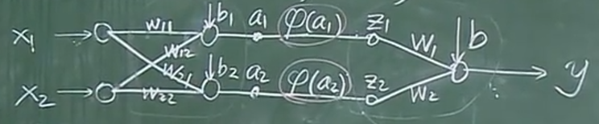

# 反向传播算法（Back Propogation）

## 1. 梯度下降法（Gradient Descent Method）求局部极值

（1）找一个 $w_0$
（2）设 $k=0$ ，若 $\left.\frac{df(w)}{dw}\right|_{w_k}=0$ ，则退出。否则，
$$
w_{k+1} = w_k - \alpha \left.\frac{df(w)}{dw}\right|_{w_k}
$$

## 2. BP(Back Propogation)算法

例子：

$$
\left\{
\begin{aligned}
    & a_1 = w_{11}x_1 + w_{12}x_2 + b_1 \\
    & a_2 = w_{21}x_1 + w_{22}x_2 + b_2 \\
    & z_1 = \varphi(a_1) \\
    & z_2 = \varphi(a_2) \\
    & y = w_1z_1 + w_2z_2 + b
\end{aligned}
\right.
$$

**输入：** $\left\{ (X_i,Y_i) \right\}_{i=1 \sim N}$

针对每一个输入 $(X,Y)$ ，目标函数为 $E=\frac{1}{2}(y-Y)^2$

（1）随机取（$w_{11}$, $w_{12}$, $w_{21}$, $w_{22}$, $b_{1}$, $b_{2}$，$w_1$，$w_2$）

（2）对所有的 $w$, 求 $\frac{\partial E}{\partial w}$，对所有 $b$，求 $\frac{\partial E}{\partial b}$

（3）
$$
W^{新} = W^{旧} - \alpha \left.\frac{\partial E}{\partial W} \right |_{W^{旧}} \\
b^{新} = b^{旧} - \alpha \left.\frac{\partial E}{\partial b} \right |_{b^{旧}}
$$

（4）当所有 $\frac{\partial E}{\partial w}$ 与$\frac{\partial E}{\partial b}$ 都为0时，退出。

计算过程：
$$
\left\{
\begin{aligned}
& \frac{dE}{dy} = (y-Y) \\
    &\frac{\partial E}{\partial a_1} 
     = \frac{dE}{dy} \cdot \frac{\partial y}{\partial z_1} \cdot \frac{dz_1}{da_1} 
     = (y-Y)w_1\varphi^{'}(a_1) \\
     &\frac{\partial E}{\partial a_2} 
     = \frac{dE}{dy} \cdot \frac{\partial y}{\partial z_2} \cdot \frac{dz_2}{da_2} 
     = (y-Y)w_2\varphi^{'}(a_2)
\end{aligned}
\right.
$$

$$
\left\{
\begin{aligned}
& \frac{\partial E}{\partial b} 
= \frac{dE}{dy} \cdot \frac{\partial y}{\partial b} = (y-Y) \\
& \frac{\partial E}{\partial w_1} = \frac{dE}{dy} \cdot \frac{\partial y}{\partial w_1} = (y-Y)z_1 \\
& \frac{\partial E}{\partial w_2} = (y-Y)z_2 \\
& \frac{\partial E}{\partial w_{11}} = \frac{\partial E}{\partial a_1}\cdot \frac{\partial a_1}{\partial w_{11}} = (y-Y)w_1\varphi^{'}(a_1)X_1 \\
& \frac{\partial E}{\partial w_{12}} = \frac{\partial E}{\partial a_1}\cdot \frac{\partial a_1}{\partial w_{12}} = (y-Y)w_1\varphi^{'}(a_1)X_2 \\
& \frac{\partial E}{\partial b_1} = (y-Y)w_1\varphi^{'}(a_1) \\
& \frac{\partial E}{\partial w_{21}} = (y-Y)w_2\varphi^{'}(a_2)X_1 \\
& \frac{\partial E}{\partial w_{22}} = (y-Y)w_2\varphi^{'}(a_2)X_2 \\
& \frac{\partial E}{\partial b_2} = (y-Y)w_2\varphi^{'}(a_2)
\end{aligned} 
\right.
$$

## 3. 激活函数 $\varphi(x)$ 

其中，$sigmoid$函数的性质：
$$
\varphi^{'}(X) = \varphi(X)[1-\varphi(X)]
$$

$tanh(x)$函数也有类似的性质：
$$
\varphi^{'}(X) = 1-[\varphi(X)]^2
$$

## 4. 一般神经网络的BP算法

 设网络的输入 $X = \begin{bmatrix}
x_1 \\ x_2 \\ \vdots \\ x_N
\end{bmatrix}$ ，是一个 $N \times 1$ 的向量，
权重矩阵 $W=\begin{bmatrix}
w_{11} & w_{12} & w_{13} & \cdots & w_{1N} \\
w_{21} & w_{22} & w_{23} & \cdots & w_{2N} \\
\vdots &  \vdots & \vdots & \ddots & \vdots \\
w_{M1} & w_{M2} & w_{M3} & \cdots & w_{MN} \\
\end{bmatrix}$ ，是一个 $M \times N$ 的矩阵，
偏置向量 $b = \begin{bmatrix}
b_1 \\ b_2 \\ b_3 \\ \vdots \\ b_M    
\end{bmatrix}$ ，是一个 $M \times 1$ 的向量。

网络结构：

（1）网络共有 $l$层，第 $m$ 层的神经元个数是 $S_m$

（2）$z^{(k)}$，$a^{(k)}$，$b^{(k)}$ 是第 $k$ 层的向量，与第 $k$ 层神经元个数一致。

（3）$z^{(k)}_i$，$a^{(k)}_i$，$b^{(k)}_i$ 分别表示 $z^{(k)}$，$a^{(k)}$，$b^{(k)}$ 的第 $i$ 个分量。

（4）用 $y_i$ 表示 $y$ 的第 $i$ 个分量

$$
\begin{aligned}
   a^{(0)}=X & \rightarrow z^{(1)} = W^{(1)}a^{(0)} + b^{(1)} \xrightarrow{\varphi} a^{(1)} = \varphi(z^{(1)}) \\
   & \rightarrow z^{(2)} = W^{(2)}a^{(1)} + b^{(2)} \xrightarrow{\varphi} a^{(2)} = \varphi(z^{(2)}) \\
   & \rightarrow \cdots \\
   & \rightarrow z^{(m)} = W^{(m)}a^{(m-1)} + b^{(m)} \xrightarrow{\varphi} a^{(m)} = \varphi(z^{(m)}) \\
   & \rightarrow z^{(m+1)} = W^{(m+1)}a^{(m)} + b^{(m+1)} \xrightarrow{\varphi} a^{(m+1)} = \varphi(z^{(m+1)}) \\
   & \rightarrow \cdots \\
   & \rightarrow z^{(l)} = W^{(l)}a^{(l-1)} + b^{(l)} \xrightarrow{\varphi} y = a^{(l)} = \varphi(z^{(l)}) \\
\end{aligned}
$$

**BP算法:**

(1) 随机初始化 $(W,b)$

(2) 训练样本 $(X, Y)$ ，代入网络，可以求出所有的 $(z,a,y)$ ，这个过程称为前向传播

(3) 链式法则求出：
$$
\left( \frac{\partial E}{\partial W} \ ,\quad \frac{\partial E}{\partial b} \right)
$$

(4) 更新：
$$
W^{(新)} = W^{(旧)} - \alpha \left.\frac{\partial E}{\partial W}\right |_{W^{(旧)}} \\
b^{(新)} = b^{(旧)} - \alpha \left.\frac{\partial E}{\partial b}\right |_{b^{(旧)}}
$$

**BP算法的推导：**
 
 设 $ \delta^{(m)}_i = \frac{\partial E}{\partial z^{(m)}_i}$ ，
$$
\left\{
\begin{aligned}
  &  \delta^{(l)}_i 
  = \frac{\partial E}{\partial z^{(l)}_i} 
  = \frac{\partial E}{\partial y_i} \cdot \frac{\partial y_i}{\partial z^{(l)}_i} 
  = (y_i-Y_i)\varphi^{'}(z^{(l)}_i) \\
& \delta^{(m)}_i 
= \frac{\partial E}{\partial z^{(m)}_i} 
= \frac{\partial E}{\partial a^{(m)}_i} \cdot \frac{\partial a^{(m)}_i}{\partial z^{(m)}_i} 
= \varphi^{'}(z^{(m)}_i)\left( \sum^{S_{m+1}}_{j=1} \delta^{(m+1)}_j \cdot W_{ji} \right) \qquad (1 \leq m \leq l-1) \\
& \frac{\partial E}{ \partial W^{(m)}_{ji}} = \delta^{(m)}_j a^{(m-1)}_i \\
        & \frac{\partial E}{\partial b^{(m)}_i} = \delta^{(m)}_i
\end{aligned}
\right.
$$
