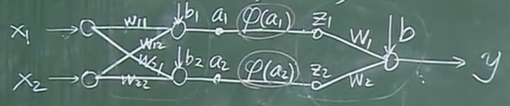
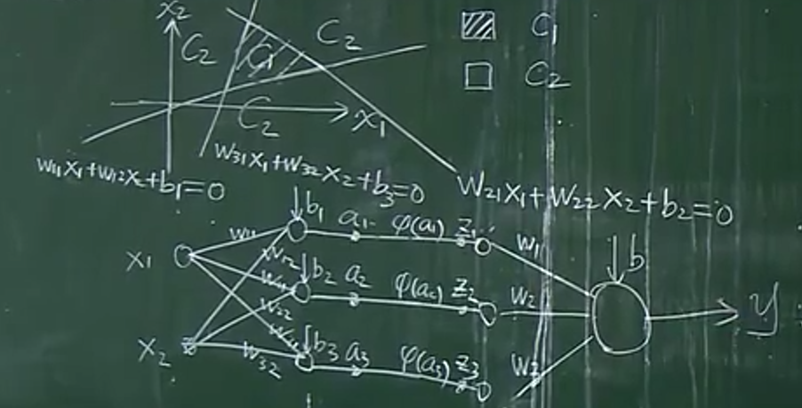
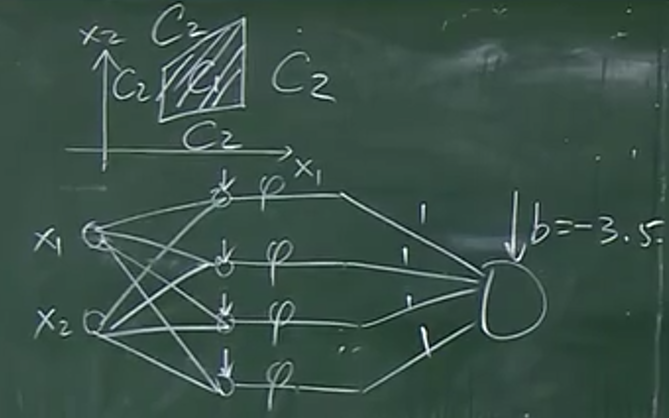
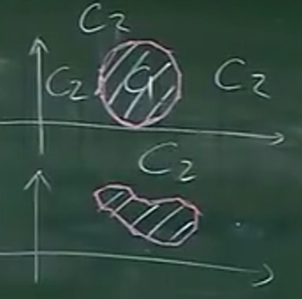

# 多层神经网络(Multiple Layer Neural Networks)

$\varphi(\cdot)$ **是一个非线性函数**
$$
\left\{
\begin{aligned}
    & a_1 = w_{11}x_1 + w_{12}x_2 + b_1 \\
    & a_2 = w_{21}x_1 + w_{22}x_2 + b_2 \\
    & z_1 = \varphi(a_1) \\
    & z_2 = \varphi(a_2) \\
    & y = w_1z_1 + w_2z_2 + b
\end{aligned}
\right.
$$
即：
$$
y = w_1\varphi(w_{11}x_1 + w_{12}x_2 + b_1) + w_2\varphi(w_{21}x_1 + w_{22}x_2 + b_2) + b
$$
如果没有$\varphi(\cdot)$ 或者$\varphi(\cdot)$是一个线性函数，那么 $y$ 的表达式仍然是一个线性模型，与感知器的线性模型没有本质区别。

**定理：三层神经网络可以模拟所有的决策面**

以两层神经网络为例子来类比：
假如一个三角形平面：

四边形平面：

曲边区域：

曲边区域可以用多条直线来模拟

注意：每一层的神经元个数可以为无限多个。

