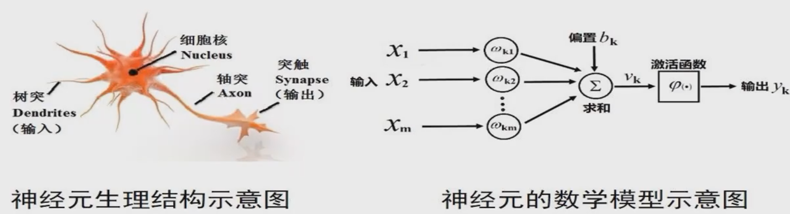

# 人工神经网络

## 1. 神经元的数学模型

1943年，心理学家W.S.McCuIIoch和数理学家W.Pitts基于神经元的生理特征，建立了单个神经元的数学模型（MP模型）

神经元的数学模型：
$$
y_k=\varphi \left( \sum_{i=1}^m w_{ki}x_i + b_k \right) = \varphi (W_k^TX + b)
$$

## 2. 感知器

1957年，Frank Rosenblatt 从纯数学的角度重新考察这一模型，指出能够从一些输入输出对 $(X,y)$ 中通过学习算法获得权重 $W$ 和 $b$ 。

### 感知器算法（Perceptron Algorithm）
（1）随机选择 $W$ 和 $b$。
（2）取一个训练样本 $(X,y)$
  （i）若 $W^TX +b>0$ 且 $y=-1$ ，则：$W=W-X, b=b-1$
  （ii）若 $W^TX +b<0$ 且 $y=+1$ ，则：$W=W+X, b=b+1$
（3）再取另一个 $(X,y)$，回到（2）
（4）终止条件：直到所有输入输出对都不满足（2）中（i）和（ii）之一，退出循环。

为了描述方便，定义两个量：
定义一个增广向量 $\vec{X}$
(a) 若 $y=+1$, 则 $\vec{X} = \begin{bmatrix} X \\ 1 \end{bmatrix}$
(b) 若 $y=-1$, 则 $\vec{X} = \begin{bmatrix} -X \\ -1 \end{bmatrix}$
定义一个增广 $W$ 如下：
$\vec{W} = \begin{bmatrix} w \\ b \end{bmatrix}$

则感知器算法可以写成：
输入 $\vec{X_i}$,
(1) 随机取 $W$
(2) 挑一个 $\vec{X_i}$，
$$
若\quad W^T\vec{X_i} < 0, \quad 则 \quad W = W + \vec{X_i}
$$
(3) 回到（2），直到对所有 $\vec{X_i}$ ，(a)与(b)都不成立时退出。

### 感知器算法收敛定理

输入 $\left\{ \vec{X_i} \right\}_{i=1 \sim N}$，若线性可分，即 $\exist \ W_{opt}$ 使：
$$
W_{opt}^T\vec{X_i} > 0 \qquad (i=1 \sim N)
$$
则利用上述感知器算法，经过有限步之后，得到一个 $W$ ，使
$$
W^T\vec{X_i} > 0 \qquad (i=1 \sim N)
$$

证明：

不失一般性，设 $||W_opt|| = 1$,

假设 第 $k$ 步的 $W$ 是 $W(k)$, 且有一个 $\vec{X_i}$，使
$$
W(k)^T \vec{X_i} < 0
$$
根据感知器算法：
$$
W(k+1) = W(k) + \vec{X_i}
$$
两边同时减去 $aW_{opt}$，再取模的平方：
$$
\begin{aligned}
    ||W(k+1)-aW_{opt}||^2 & = ||W(k) + \vec{X_i}-aW_{opt}||^2 \\
    & = ||\left(W(k)-aW_{opt}\right) + \vec{X_i}||^2 \\
    & = ||W(k)-aW_{opt}||^2 + ||\vec{X_i}||^2+2W(k)^T\vec{X_i} - 2aW_{opt}^T\vec{X_i}
\end{aligned}
$$
一定可以取很大的 $a$, 使
$$
||W(k+1)-aW_{opt}||^2 <  ||W(k)-aW_{opt}||^2
$$
定义：$\beta = \mathop{max}\limits_{i=1\sim N} \left\{ ||\vec{X_i}|| \right\}，\gamma = \mathop{min}\limits_{i=1\sim N}\left( W_{opt}^T X_i \right)$，

取 $a=\frac{\beta^2+1}{2\gamma}$，则
$$
||W(k+1)-aW_{opt}||^2 < ||W(k)-aW_{opt}||^2-1
$$
取 $D = ||W(0)-aW_{opt}||$，则至多经过 $D^2$ 步，$W$将会收敛至 $aW_{opt}$ 。