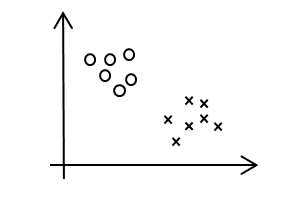
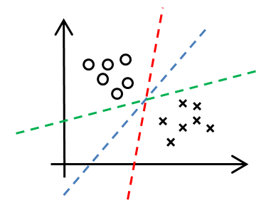
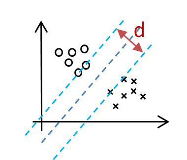

# 支持向量机（Support Vector Machine）—— 线性问题

## 1.1 问题的引入
假设在一个二维平面内存在两种样本，

其分布如下图：

此时，需要在两种样本之间画一条直线对样本进行分类。如果随意画几条线那么将会是下面这样的：

为了在这些直线中找到最合适一条线，从而引入支持向量机算法。

将每一条直线向两边平行移直到碰到一个或几个样本点，中间可移动的距离称为直线的**间隔（Margin）**，记为$d$。而两边被直线所碰到点称为**支持向量（Support Vector）**。

可以认为，$d$最小的直线即为要寻找的划分区域最好的直线。

## 1.2 数学描述

定义：

（1）训练数据及标签($X_1$, $y_1$), ($X_2$, $y_2$), ... , ($X_N$, $y_N$)

其中的每一个$X_i$代表一个向量, 每一个$y_i$是该$X_i$的标签，$y_i\in\left\{-1,1\right\}$

（2）线性模型：$\left(W, b \right)$  

$$
W^TX + b = 0
$$

这里的$W$也是一个和$X_i$同维度的向量，而$b$是一个常数。

在二维平面这是一条直线，而在高维空间中，这是一个**超平面(Hyperplane)**。

（3）一个训练集线性可分是指：

$$\left\{ \left(X_i, y_i \right) \right\}_{i=1\sim N} $$

$\exists \left( W, b\right)$, 使：

对于 $\forall \,i=1\sim N$，有：

(1) 若 $y_i=1$，则$W^TX_i+b\geq 0$

(2) 若 $y_i=-1$，则$W^TX_i+b < 0$

这里的两个条件其实可以合并成一个条件： 
$$y_i\left[W^Tx_i+b\right]\geq1\quad\left(i=1\sim N\right)$$

## 3. 优化问题

### 两个事实

事实1：$W^TX+b=0$ 与 $aW^TX+ab=0\, \left(a\in R^+ \right)$ 是同一个平面。

若$\left(W,b\right)$满足公式（1），则$\left(aW,ab\right)$也满足公式（1）

事实2：点到直线的距离公式

平面 $w_1x + w_2y = 0$，则点 $\left(x_0, y_0\right)$到此平面的距离为：
$$
d = \frac{|w_1x_0 + w_2y_0 + b|}{\sqrt{w_1^2 + w_2^2}}
$$

由事实2可以得到向量 $X_0$ 到超平面 $W^TX+b=0$ 的距离 $d$ 为：
$$
d = \frac{|W^TX_0 + b|}{||W||}
$$

由事实1我们可以用 $a$ 去缩放 $\left(W, b\right) \rightarrow \left(aW, ab\right)$，最终使在支持向量 $X_0$ 上有：
$$
|W^TX_0 + b| = 1
$$

此时，支持向量与平面的距离
$$
d = \frac{1}{||W||}
$$

最大化间隔，即是最大化距离 $d$ ，即最小化 $||W||$。

最终，优化问题可以总结为一个二次规划问题：

最小化（Minimize）: $||W||^2$

限制条件（Subject to）：$y_i\left[W^Tx_i+b\right]\geq1\quad\left(i=1\sim N\right)$

> 二次规划(Quadratic Programming)：
> 
>（1）目标函数（Objective Function）二次项
>
> （2）限制条件一次项
>  
> 可以证明，二次规划问题要么无解，要么只有一个解。

