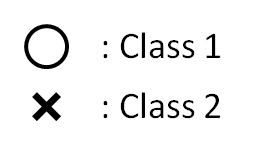

# 没有免费午餐定理（No Free Lunch Theorem）

**思想：如果我们不对特征空间有先验假设，则所有算法的平均表现是一样的。**

假设在计算机的存储单元中有以下两类数据：

并且假设计算机中的存储单元有下面四种已知和未知的情况。

## 1.第一种情况
有两个存储单元，已知第一个存储单元的内容为圆圈，则所有可能出现的情况有：

在没有先验条件的情况下，那么第一种情况和第二种情况出现的可能性相等。

## 2.第二种情况
存储单元为三个，并且已知第一个存储单元为圆圈的情况下，则所有可能出现的情况有：

在没有先验条件的情况下，这四种情况出现的可能性也是相等的。

## 3. 第三种情况
存储单元为三个，并且已知第一个存储单元中的数据为圆圈，第二个存储单元的数据为叉，则所有可能出现的情况有：

同样地， 在没有任何先验条件的情况下，这两种情况出现的可能性是相等的。

## 4. 第四种情况
假设计算机中的存储单元更多，已知的存储单元如下：

在图上的这种情况下，如果没有先验条件的情况下，两个未知存储单元中是圆圈和叉的可能性也是相等的。

## 总结
从以上的四种情况可以看出，对于没有先验知识的人以及没有先验知识的计算机来说，算法执行结果并没有明确的好坏标准。因为人的好坏标准通常是通过先验知识总结而来的。

绝大多数的特定算法只能在某一种或几种先验条件下得出该先验条件下的比较好的结果。

一种算法在一种先验条件下的结果越好，那么它的泛化能力也越可能变差。换句话说，就是没有所谓的“万能算法”。

**但是在日常生活中，我们认为：特征差距小的样本更有可能是同一类。**

